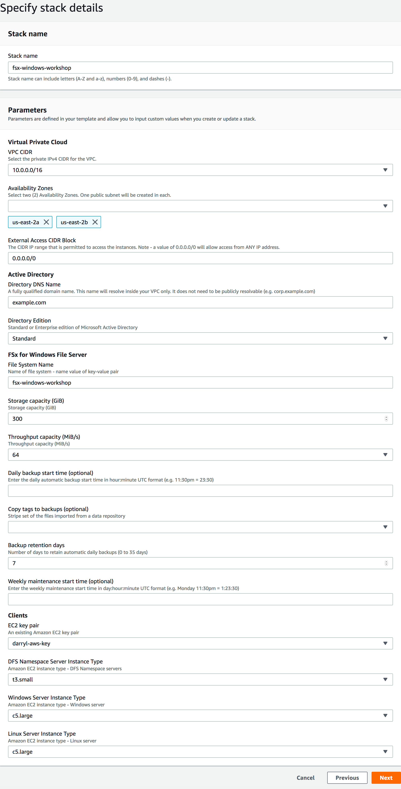
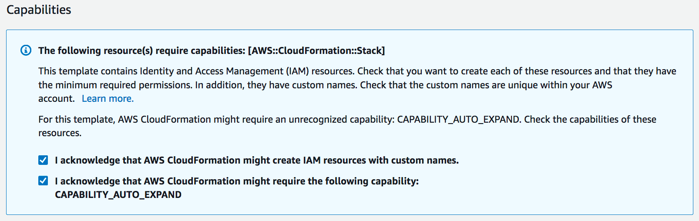

# **Amazon FSx for Windows File Server**

## Create Workshop Environment

### Version 2019.04

fsx.w.wrkshp.2019.04

---

Errors or corrections? Email us at [darrylo@amazon.com](mailto:darrylo@amazon.com).

---
### Prerequisites

* An AWS account with administrative level access
* An Amazon EC2 key pair

If a key pair has not been previously created in your account, please refer to [Creating a Key Pair Using Amazon EC2](http://docs.aws.amazon.com/AWSEC2/latest/UserGuide/ec2-key-pairs.html#having-ec2-create-your-key-pair) from the AWS EC2 User's Guide.  

Verify that the key pair is created in the same AWS region you will use for the tutorial.

WARNING!! This workshop environment will exceed your free-usage tier. You will incur charges as a result of building this environment and executing the scripts included in this workshop. Delete all AWS resources created during this workshop so you don’t continue to incur additional compute and storage charges.

---
### Create Amazon FSx for Windows File Server Workshop Environment

Click on the link below in the desired AWS region to create the AWS Cloudformation stack that will create an Amazon VPC, an AWS Managed Microsoft AD, an Amazon FSx for Windows File Server file system,  two Microsoft EC2 instances running the Distributed File System Namespaces role, and a Windows and Linux EC2 instance. Use the following parameters and the screenshot below as a guide to enter the appropriate AWS CloudFormation parameter values.

#### Parameters

- Stack name - accept default
- VPC CIDR - select one
- Availability zones (2) - select two
- External access CIDR - accept default
- Active Directory - accept default
- Directory edition - accept default
- File system name - accept default
- Storage capacity (GiB) - accept default
- Throughput capacity (MiB/s) - accept default
- Daily backup start time (optional) - accept default
- Copy tags to backups (optional) - accept default
- Backup retention days - accept default
- Weekly maintenance start time (optional) - accept default
- EC2 key pair - select one
- DFS Namespace server instance type - accept default
- Windows server instance type - accept default
- Linux server instance type - accept default

IMPORTANT!! Before selecting "Create stack" at the end of the AWS CloudFormation create stack wizard, make sure you check both boxes in the "Capabilities" section. If not, the stack will fail at the very end (20-35 minutes) and you'll have to start over.

---

Click on the link below in the desired AWS region to create the AWS CloudFormation stack that will create an Amazon VPC, AWS Managed Microsoft AD (enterprise), and two Windows EC2 instances running the Distributed File System Namespaces role.

| AWS Region Code | Region Name |
| :--- | :--- 
| us-east-1 | [US East (N. Virginia)](https://console.aws.amazon.com/cloudformation/home?region=us-east-1#/stacks/new?stackName=fsx-windows-workshop&templateURL=https://s3.amazonaws.com/amazon-fsx/workshop/windows/00-fsx-workshop-master.yaml) |
| us-east-2 | [US East (Ohio)](https://console.aws.amazon.com/cloudformation/home?region=us-east-2#/stacks/new?stackName=fsx-windows-workshop&templateURL=https://s3.amazonaws.com/amazon-fsx/workshop/windows/00-fsx-workshop-master.yaml) |
| us-west-2 | [US West (Oregon)](https://console.aws.amazon.com/cloudformation/home?region=us-west-2#/stacks/new?stackName=fsx-windows-workshop&templateURL=https://s3.amazonaws.com/amazon-fsx/workshop/windows/00-fsx-workshop-master.yaml) |
| eu-west-1 | [EU West (Ireland)](https://console.aws.amazon.com/cloudformation/home?region=eu-west-1#/stacks/new?stackName=fsx-windows-workshop&templateURL=https://s3.amazonaws.com/amazon-fsx/workshop/windows/00-fsx-workshop-master.yaml) |
| eu-west-1 | [AP Southeast (Sydney)](https://console.aws.amazon.com/cloudformation/home?region=ap-southeast-2#/stacks/new?stackName=fsx-windows-workshop&templateURL=https://s3.amazonaws.com/amazon-fsx/workshop/windows/00-fsx-workshop-master.yaml) |
| eu-west-1 | [AP Northeast (Tokyo)](https://console.aws.amazon.com/cloudformation/home?region=ap-northeast-1#/stacks/new?stackName=fsx-windows-workshop&templateURL=https://s3.amazonaws.com/amazon-fsx/workshop/windows/00-fsx-workshop-master.yaml) |

---
## Next section
### Click on the link below to go to the next section

| [**Map File Share**](../01-map-file-share) |
| :---
---

For feedback, suggestions, or corrections, please email me at [darrylo@amazon.com](mailto:darrylo@amazon.com).

## License Summary

This sample code is made available under a modified MIT license. See the LICENSE file.
